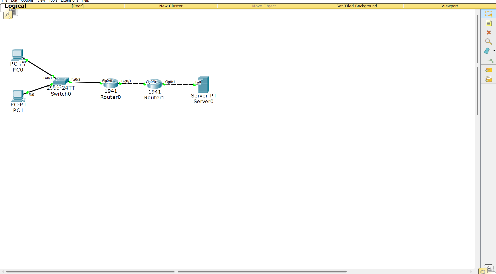
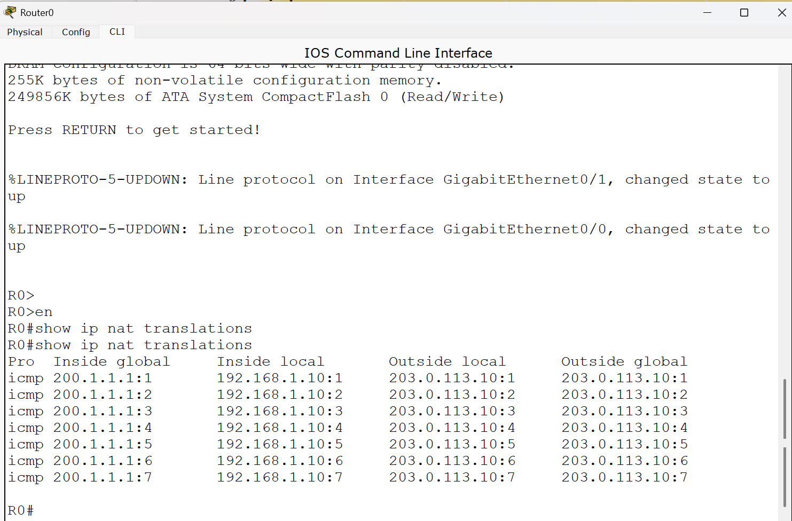

# CCNA Lab 07 - NAT & PAT

## Project Overview

This lab demonstrates how Network Address Translation (NAT) and Port Address Translation (PAT) allow devices with private IP addresses to communicate with an external network using Cisco Packet Tracer.

A Cisco router was configured with NAT Overload so that multiple internal devices could share the same outside IP address.

---

##  Objectives

- Understand the purpose of NAT and PAT
- Identify inside and outside networks
- Configure NAT Overload (PAT)
- Use an ACL to identify internal addresses for translation
- Configure a default route toward the external network
- Verify NAT translations
- Test connectivity between internal devices and an external server

---

##  Tools

- Cisco Packet Tracer
- GitHub
- Markdown

---

##  Network Topology



---

##  Network Configuration

### Inside Network

**Network:** `192.168.1.0/24`

- R0 G0/0: `192.168.1.1`
- PC0: `192.168.1.10`
- PC1: `192.168.1.20`
- Default Gateway: `192.168.1.1`

### R0 ↔ R1 Network

**Network:** `200.1.1.0/30`

- R0 G0/1: `200.1.1.1`
- R1 G0/0: `200.1.1.2`

### External Network

**Network:** `203.0.113.0/24`

- R1 G0/1: `203.0.113.1`
- Server0: `203.0.113.10`
- Server Default Gateway: `203.0.113.1`

---

##  Configuration Steps

1. Configured IP addresses on all PCs, routers, and the external server.
2. Configured R0 G0/0 as the NAT inside interface.
3. Configured R0 G0/1 as the NAT outside interface.
4. Created a standard ACL to identify the internal network.
5. Configured PAT using NAT Overload.
6. Configured a default route from R0 toward R1.
7. Verified connectivity between R0 and R1.
8. Verified connectivity between R1 and the external server.
9. Tested external connectivity from PC0 and PC1.
10. Verified NAT translations using `show ip nat translations`.

---

##  NAT/PAT Configuration

```cisco
access-list 1 permit 192.168.1.0 0.0.0.255

interface GigabitEthernet0/0
 ip nat inside

interface GigabitEthernet0/1
 ip nat outside

ip nat inside source list 1 interface GigabitEthernet0/1 overload

ip route 0.0.0.0 0.0.0.0 200.1.1.2
```

---

##  NAT Translation

The internal devices use private IP addresses:

```text
PC0 → 192.168.1.10
PC1 → 192.168.1.20
```

Using PAT, the router translates the internal addresses to its outside interface address:

```text
192.168.1.10 ──┐
                ├── PAT ──> 200.1.1.1
192.168.1.20 ──┘
```

PAT allows multiple internal devices to share the same outside address while distinguishing their connections using transport-layer port numbers or protocol-specific identifiers.

---

##  Test Results

PC0 and PC1 successfully communicated with the external server at:

`203.0.113.10`

NAT translations were successfully verified on R0 using:

```cisco
show ip nat translations
```

Example translation:

```text
Inside Global: 200.1.1.1
Inside Local:  192.168.1.20
Outside Local: 203.0.113.10
Outside Global: 203.0.113.10
```

**Result:** NAT Overload (PAT) was successfully configured and verified.

---

##  NAT Translation Verification



---

## Skills Learned

- Network Address Translation (NAT)
- Port Address Translation (PAT)
- NAT Overload
- Inside and outside interfaces
- Private and external IP addressing
- Standard ACL configuration
- Default routing
- NAT translation verification
- Cisco IOS CLI
- Network troubleshooting

---

##  Project Files

- [Packet Tracer File](Packet-tracer/nat-pat-lab.pkt)
- [Network Topology](image/Topology.png)
- [NAT Translation Verification](image/NAT-Translations.png)

---

##  Author

**Kawthar Bader**

Computer Networks Student | CCNA Learner | Building Networking Labs

---

